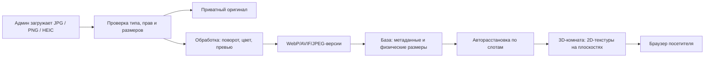

# Технический план MVP

**Статус:** решение для первого рабочего релиза  
**Зафиксированная модель:** картины — 2D-сканы/фотографии; трёхмерными являются только зал, стены, освещение, рамы и камера.

## 1. Техническая схема



Рекомендуемый продуктовый стек: **Next.js + TypeScript**, **React Three Fiber / Three.js**, **PostgreSQL**, S3-совместимое объектное хранилище и CDN. Выбор конкретного хранилища и сервиса обработки изображений остаётся отдельным решением перед запуском.

## 2. Как отобразить работы разных форматов

Каждой работе задаются физические `width` и `height` в сантиметрах, независимо от размера файла в пикселях. Из них получается отношение сторон `ratio = width / height`.

В шаблоне комнаты каждая стена имеет слоты с максимальными границами и типом: `portrait`, `square`, `landscape`.

1. Система относит картину к типу по её `ratio`.
2. Находит свободный слот соответствующего типа.
3. Вычисляет единый коэффициент масштаба `min(slotWidth / imageWidth, slotHeight / imageHeight)`.
4. Создаёт в 3D прямоугольную плоскость с пропорциями картины; изображение накладывается на неё без crop/stretch.
5. При необходимости добавляет отдельную простую 3D-раму вокруг плоскости.

Если подходящих слотов больше нет, админ видит предупреждение и вручную меняет порядок, шаблон или слот. Автоматически уменьшать все работы до нечитаемого размера нельзя.

Первый шаблон — светлая прямоугольная комната с деревянным полом, высоким потолком и трековым освещением. Шаблон содержит плоскости задней, левой и правой стен; у боковых стен есть перспективное преобразование, поэтому висящие на них 2D-картины визуально следуют геометрии помещения.

Важно: скан часто содержит поля, тень или раму. В админке понадобится кадрирование перед публикацией и переключатель «рамка уже внутри изображения», иначе визуальный масштаб будет неточным.

## 3. Медиа-конвейер

### Принимаемые форматы

- `image/jpeg` (`.jpg`, `.jpeg`)
- `image/png`
- `image/heic`, `image/heif` (`.heic`, `.heif`)

Расширение файла не является достаточной проверкой: сервер проверяет фактический MIME-тип и декодируемость. HEIC хранится как исходник, но не используется в публичной сцене, поскольку поддержка HEIC в браузерах непостоянна.

### Производные версии

| Версия | Назначение | Доступ |
| --- | --- | --- |
| Original | архив и повторная обработка | только админ |
| Thumbnail | результаты поиска и админка | публичный после публикации |
| Scene | текстура плоскости в 3D | публичный после публикации |
| Detail | карточка работы и увеличение | публичный после публикации |

После распознавания система применяет EXIF-поворот, нормализует цветовой профиль и создаёт совместимые WebP/AVIF и JPEG-fallback. В выбранной среде обработки обязательно проверяется поддержка HEIC/HEIF: публикация блокируется, если конвертация не удалась.

## 4. Модель данных

```text
artists(id, name, aliases, slug, biography, portrait_asset_id, status)
artworks(id, artist_id, title, year, medium, width_cm, height_cm,
         description, rights_confirmed_at, source_asset_id, status)
assets(id, artwork_id, original_mime, source_width_px, source_height_px,
       thumbnail_url, scene_url, detail_url, processing_status)
gallery_rooms(id, artist_id, template_id, status)
gallery_placements(id, room_id, artwork_id, slot_id, scale, frame_style)
viewpoints(id, room_id, x, y, z, yaw, allowed_transitions)
```

Ключевые правила:

- Черновые и неопубликованные записи никогда не попадают в публичный поиск или CDN URL.
- `width_cm` и `height_cm` обязательны до публикации.
- На одну опубликованную работу должна существовать хотя бы одна успешно обработанная `scene_url` и `detail_url`.

## 5. Этапы реализации

### Этап 1 — подтверждение опыта посетителя

Готово в текущем прототипе: поиск художника, CSS-демонстрация 3D-комнаты, точки обзора, навигация, доступные карточки 2D-работ и 2D-список. Это инструмент для согласования интерфейса, а не финальная 3D-технология.

### Этап 2 — базовое приложение и каталог

1. Инициализировать Next.js-приложение и базу данных.
2. Сделать публичный поиск, маршруты художника и 2D-каталог.
3. Добавить авторизацию с одной ролью `admin`.
4. Реализовать художника, работы, статусы черновика/публикации.

### Этап 3 — админка и обработка медиа

1. Загрузка JPG, PNG и HEIC с отображением процесса обработки.
2. Кадрирование, реальные физические размеры, метаданные и подтверждение прав.
3. Создание производных версий, обработка ошибок и безопасная публикация.
4. Подбор слотов, ручная корректировка и предпросмотр комнаты.

### Этап 4 — настоящая 3D-комната

1. Использовать процедурный шаблон зала Three.js: светлые стены, деревянный пол, потолок и треки; glTF оставить только как возможную будущую альтернативу для авторской архитектуры.
2. Загрузить `scene`-версии изображений как текстуры плоских объектов.
3. Реализовать точки обзора, клики по работам, освещение и рамы.
4. Добавить 2D fallback при отсутствии WebGL, lazy-loading текстур и контроль памяти.

### Этап 5 — проверка перед первым показом

1. Прогнать набор из портретного JPG, квадратного PNG и горизонтального HEIC.
2. Проверить, что ни одна картина не растягивается и не обрезается.
3. Проверить мышь, touch, клавиатуру и режим без WebGL.
4. Проверить доступность, производительность и снятие работы с публикации.

## 6. Ближайшее решение

До подключения backend нужно согласовать один шаблон зала и реальный небольшой набор работ для теста. Для каждого тестового полотна понадобятся: файл, автор, название, год, техника, физическая ширина и высота, а также подтверждение права на публикацию.
